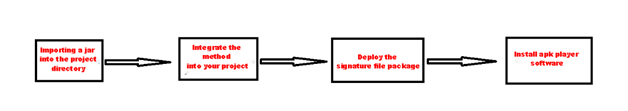
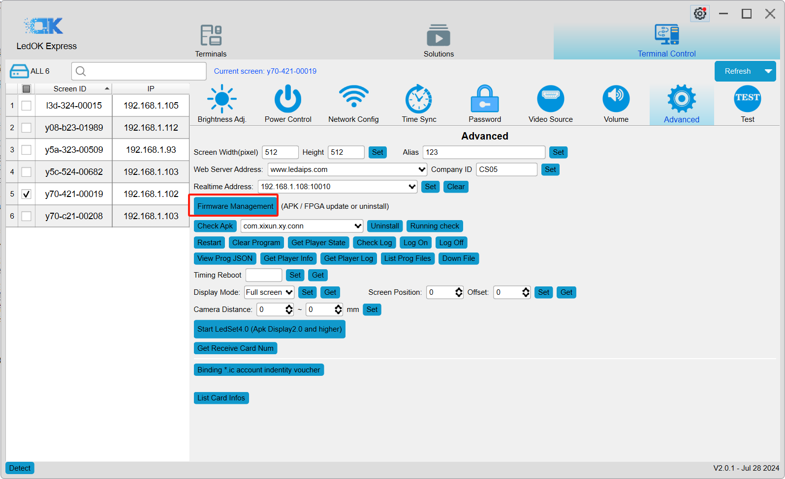

[TOC]

# Android Development Solutions

## 1、Solution overview

Direct development of Android apk, this open method is the most flexible. Some functions need to use CardSystem's port (see xixun_card_setting.zip for details).

Background knowledge：

- Knowledge of a programming language capable of developing Android (JAVA, Kotlin, Scala, etc.)
-  Knowledge of the basics related to Android (Activity, Service, BroadcastReceiver, etc.)

## 2、About the development of apk version compatibility issues

### 2.1、First, download the Ledok software

Visit	 https://www.sysolution.net/news/software-download-73889.html	to find the LedOK software download link pictured here

### 2.2、See the Android version of the control card

Open LedOK

### 2.3、Set apk android compatible version 

Open the Android development tools, there is a build.gradle file under the app directory of the project, open that file

Modify the minimum compatible version, the following is the version comparison table.

| API level | **Original Android version** | **Linux kernel version** |
| --------- | ---------------------------- | ------------------------ |
| 28        | 9                            |                          |
| 27        | 8.1                          | 4.10                     |
| 26        | 8.0                          | 4.10                     |
| 25        | 7.1                          | 4.4.1                    |
| 24        | 7.0                          | 4.4.1                    |
| 23        | 6.0                          | 3.18.10                  |
| 22        | 5.1                          | 3.16.1                   |
| 21        | 5.0                          | 3.16.1                   |
| 20        | 4.4w                         | 3.10                     |
| 19        | 4.4                          | 3.10                     |
| 18        | 4.3                          | 3.4.0                    |
| 17        | 4.2                          | 3.4.0                    |
| 16        | 4.1                          | 3.0.31                   |
| 15        | 4.0.3                        | 3.0.1                    |
| 14        | 4.0                          | 3.0.1                    |
| 13        | 3.2                          | 2.6.36                   |
| 12        | 3.1                          | 2.6.36                   |
| 11        | 3.0                          | 2.6.36                   |

## 3、To use the API provided by our company, you need to import the xixun_card_setting.jar file.

You can find this file in the folder with the same name as this document.

You can find this file in the folder with the same name as this document.

##### 3.1、 Import the xixun_card_setting.jar file

##### 3.2 Find a method to integrate into your own APK (taking screen on/off as an example)

Click on CardService.aidl, where you can see methods with comments, including the screen on/off method. Just call the method with the correct parameters.

​      Here are the brightness methods, all of which can be called with the input parameters.

##### 3.3 Get GPS data through your own APK

  Refer to the method file for obtaining GPS under the demo folder

##### 3.4 After integrating into your own apk, you may need a signature file when packaging, you need to contact the business to sign a confidentiality agreement, and then provide an email to send.

##### 3.5 Simple Process Topology

## 4、Install the APK on the controller card

Open LedOK, click on Terminal Control and then click on Advanced Settings, enter the password 888 and uninstall xixunplayer first.

Click apk upgrade, select the apk and click OK, wait for the prompt to upgrade successfully.

