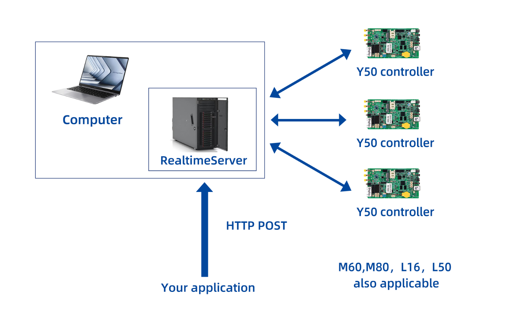

[TOC]

# 1、realtime solution brief introduction

Based on Sysolution Realtime SDK, using web technology and http communication (be good at JavaScript), this is a quick development solution although with limited functions. 

Necessary Preparation：

- Know html+css
- Be good at JavaScript
- At least know one back-end develop language（C#, JAVA, PHP, nodejs,etc）

## 1.1、Realtime Diagram

# 2、Realtime server environment buildup

## 2.1、brief introduction

- This solution only workable for users who have knowledge of web technology, can visit any website by using loadUrl interface,Provide invokeJs to call javascript method in current webpage (can transfer text data via this method) to realize real time display, users can customize define display interface and logic.

## 2.2、Install

- Java：install the correct jdk according to the operation system and setup environment variable, support java1.8 and above.   

## 2.3  run

​        To run the service, please refer to the configuration instructions in the java directory